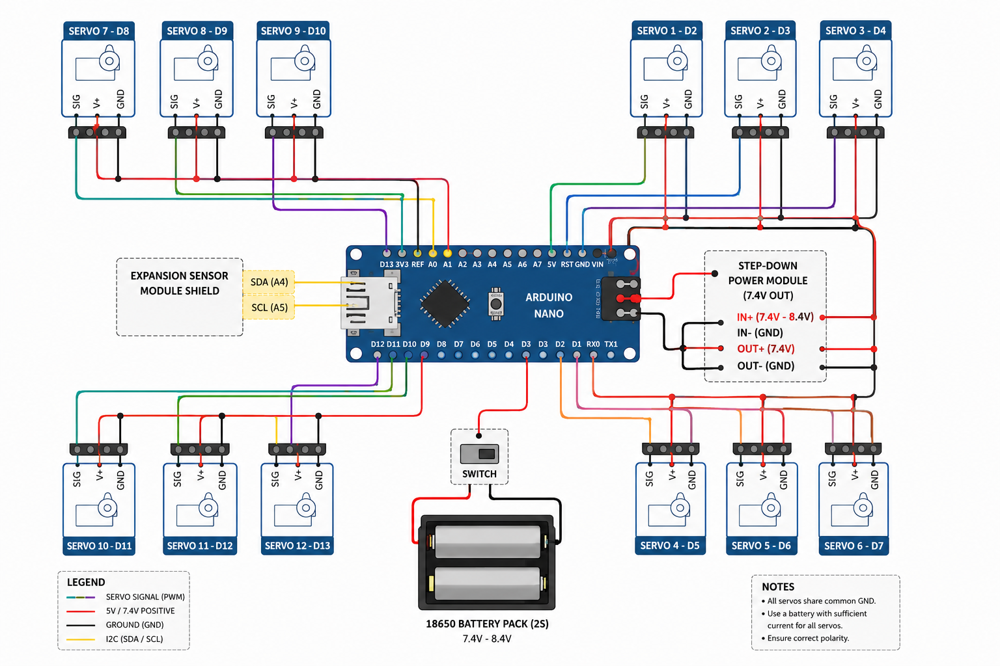

# Quadruped Spider Robot

An autonomous 4-legged spider robot built with Arduino Nano, controlled by 12 servo motors and programmed with inverse kinematics for coordinated movement.

## Overview

The robot uses a 3D-printed frame, an Arduino Nano, and a custom gait algorithm to achieve stable, balanced movement across flat and slightly uneven surfaces. Movement is autonomous — no remote control required.

## Hardware

| Component | Quantity | Notes |
|-----------|----------|-------|
| Arduino Nano (ATmega328P) | 1 | Main microcontroller |
| NANO I/O Expansion Shield | 1 | Servo pin routing |
| SG90 Micro Servo Motor | 12 | 3 per leg |
| LM2596S DC-DC Step-Down Module | 1 | 7.4V–8.4V → 7V |
| 18650 Li-Ion Battery | 2 | ~30 min autonomy |
| 3D Printed Parts | 22 | Frame and leg segments |

**Total cost: ~44 EUR**

## Wiring



Each leg uses 3 servos connected to the expansion shield:

```
Leg 0: D3, D4, D2
Leg 1: D6, D7, D5
Leg 2: D9, D8, D10
Leg 3: D12, D11, D13
```

Power is supplied through the step-down module from two 18650 batteries in series.

## Software

### Libraries
- `Servo.h` — servo motor control
- `FlexiTimer2.h` — timer interrupt for servo position updates at 20ms intervals

### Movement Functions

| Function | Description |
|----------|-------------|
| `step_forward(n)` | Walk forward n steps |
| `step_back(n)` | Walk backward n steps |
| `turn_left(n)` | Rotate left n steps |
| `turn_right(n)` | Rotate right n steps |
| `hand_wave(n)` | Wave front leg n times |
| `hand_shake(n)` | Handshake motion n times |
| `sit()` | Lower body to rest position |

### How Movement Works

The robot uses a **Cartesian → Polar coordinate conversion** to translate target foot positions into servo angles. Each leg's position is defined in 3D space `(x, y, z)` and converted to three joint angles `(alpha, beta, gamma)` via `cartesian_to_polar()`.

`servo_service()` runs on a 20ms timer interrupt and smoothly interpolates each servo from its current position toward the target, producing fluid movement.

The gait alternates between two leg pairs — legs 0&3 and legs 1&2 — lifting and placing them sequentially to maintain balance.

### Default Motion Loop

```cpp
step_forward(10);
step_back(10);
turn_left(5);
turn_right(5);
hand_wave(3);
hand_shake(3);
sit();
```

## Files

```
├── Basic_repetitive_movements_code.ino   # Main movement code
├── Basic_position_of_servo_motors.ino    # Servo calibration/positioning
└── flexitimer2-master/                   # Timer interrupt library
```

## Build & Flash

1. Install [Arduino IDE](https://www.arduino.cc/en/software)
2. Add `FlexiTimer2` — place `flexitimer2-master/` in your Arduino libraries folder
3. Open `Basic_repetitive_movements_code.ino`
4. Select **Arduino Nano** + correct COM port
5. Upload

## Robot Geometry

```
length_a = 55mm   (coxa)
length_b = 77.5mm (femur)
length_c = 27.5mm (tibia)
length_side = 71mm (body half-width)
```

## Credits

Gait algorithm and inverse kinematics adapted from open-source quadruped robot projects. Hardware assembly, calibration, and movement tuning done independently.
